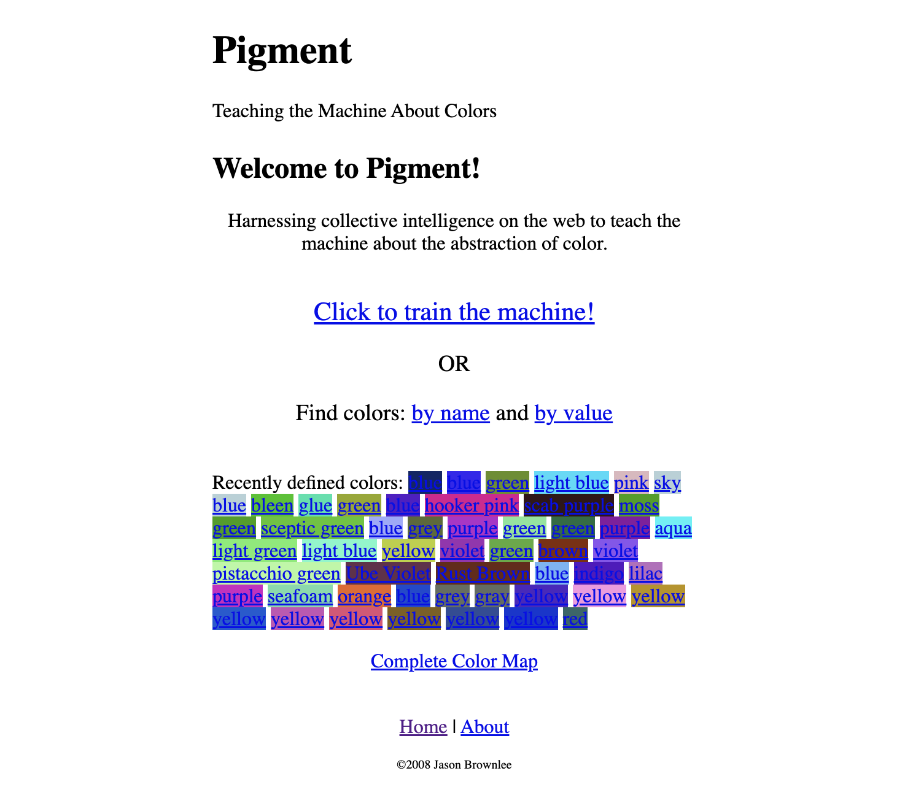

# Pigment

Archive of the Pigment project, hosted at `pigment.heroku.com`, circa 2008.

## About

## Screenshots

## Code

The website was developed using Ruby on Rails and hosted on Heroku.

The code and dump of the database have been lost.

## Sources

### Homepage

* [http://pigment.heroku.com](https://web.archive.org/web/20081024232930/http://pigment.heroku.com/) (archived)

### Blog Posts

* [A Day With Heroku: Building a Simple Color Crowdsourcing App](https://web.archive.org/web/20080530220737/http://www.neverreadpassively.com/2008/05/day-with-heroku-building-simple-color.html) (archived)